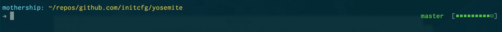

termconfig
==========

Termconfig configures your terminal to look like this:

It is a combination of:
- [zsh](http://www.zsh.org/)
- [oh-my-zsh](http://ohmyz.sh/)
- [solarized](http://ethanschoonover.com/solarized)
- [iconsolata](https://www.google.com/fonts/specimen/Inconsolata)

It installs:
- wget (needed for terminal setup)
- homebrew (needed for terminal setup)

It can install:
- atom (optional)
- iTerm2 (optional)
- google chrome (optional)

# ScreenShots

Sources, Vendors, & Inspiration:
- http://code.tutsplus.com/tutorials/how-to-customize-your-command-prompt--net-24083
- https://github.com/mathiasbynens/dotfiles
- https://gist.github.com/PuddingNL/2285485
